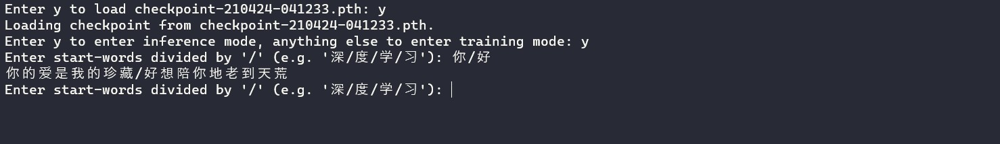

_(注：很基本的 RNN 模型，预测效果一般，仅作为学习使用！)_

# 安装关联

- PyTorch:
  `pip3 install torch==1.8.1+cu102 torchvision==0.9.1+cu102 torchaudio===0.8.1 -f https://download.pytorch.org/whl/torch_stable.html` (请根据你的环境选择对应的版本安装 https://pytorch.org/)
- Tensorboard: `pip3 install tensorboard`
- NumPy: `pip3 install numpy`

# 训练 & 使用模型预测

在命令行中输入 `python3 main.py`，根据提示训练或者使用模型做预测。

# 使用 Tensorboard 查看训练进度

开启一个新的控制台，输入 `tensorboard --logdir=runs`
